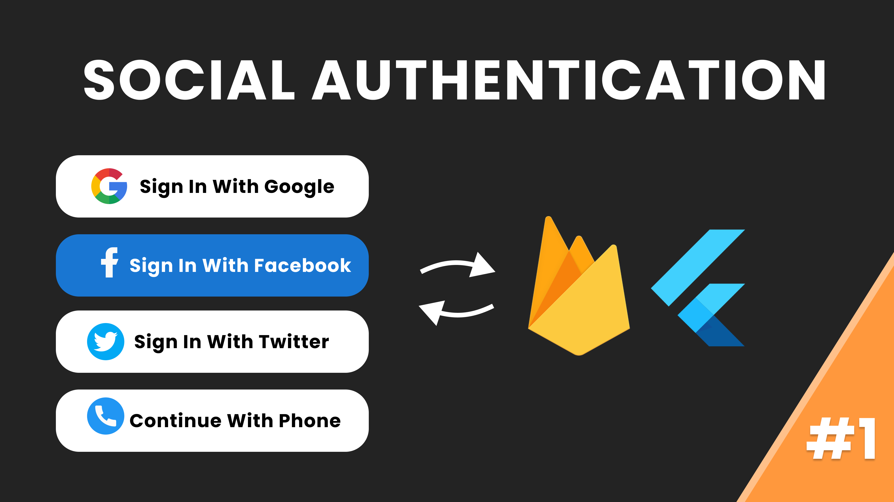

# socialauth_flutter_firebase
Social Auth In Flutter and Firebase (Google, Facebook, Twitter and Phone Auth)

# Overview
This social auth tutorial in flutter and firebase is the ultimate guide for you to integrate authentication with social providers like Google, Facebook, Twitter and Phone Auth

 
 
 
Happy Learning 👍

<h3>Stay Healthy!✨Stay Safe!🖖</h3>
 

## Note
 I do not own any of the images used in this project.

For help getting started with Flutter, view our
[online documentation](https://flutter.dev/docs), which offers tutorials,
samples, guidance on mobile development, and a full API reference.

